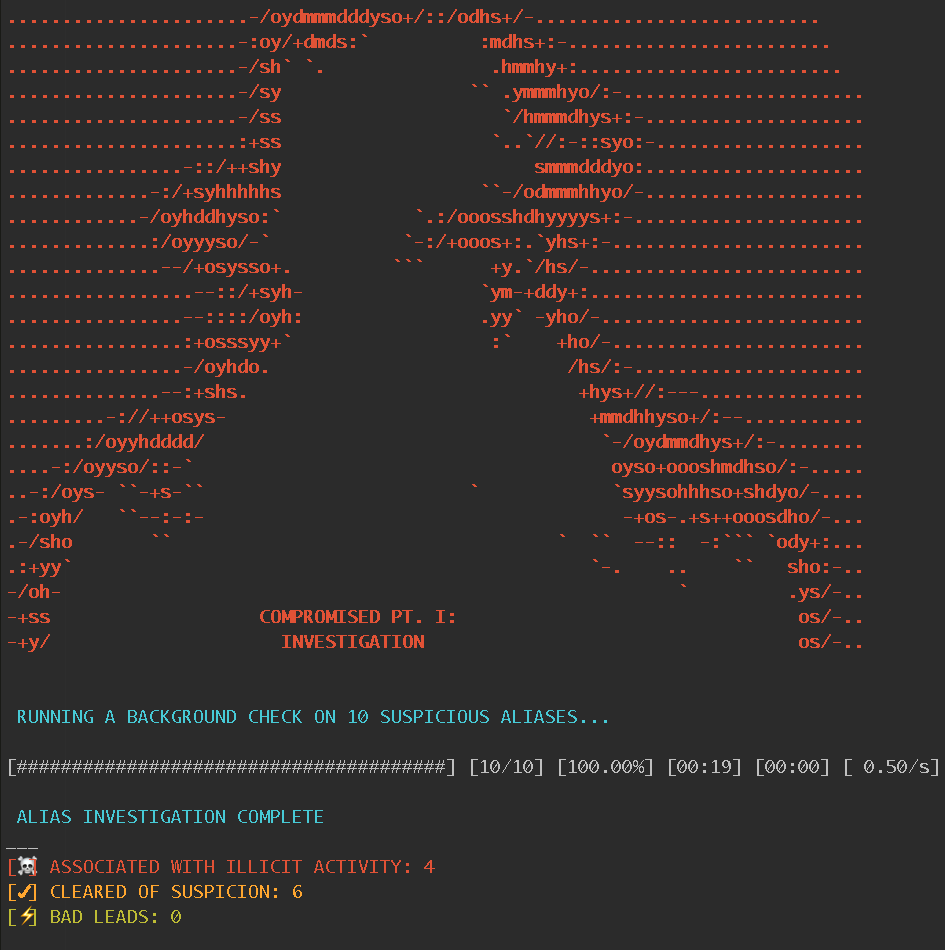

# Compromised Pt. I: Investigation

This script checks the http://haveibeenpwned.com database for accounts compromised in PUBLICLY RELEASED breaches. Further API documentation can be found at: https://haveibeenpwned.com/API/v2. Based on the PwnedCheck gem and sample script written by Carl Sampson http://github.com/sampsonc/PwnedCheck

## Use Case

Check list of usernames, email addresses, or phone numbers to determine if they were compromised in a breach

## Requirements

1. ruby >= 2.4.0 
2. Install the following 3 gems:

    `gem install paint progress_bar PwnedCheck` 

## Usage

    $ ruby compromised_investigation.rb <email-list.csv>

## Output
### Terminal
I wanted the output formatted in a Private Investigator theme. Here's what the output means in plain English:
* "ASSOCIATED WITH ILLICIT ACTIVITY" = Found in at least one confirmed breach
* "CLEARED OF SUSPICION" = Not found in any confirmed breaches
* "BAD LEADS" = Errors raised due to misformatted input

### CSV
<table>
 <tr>
  <th>Account</th>
  <th>Finding</th>
  <th>BreachName</th>
  <th>BreachDate</th>
  <th>MostRecent</th>
 </tr>
 <tr>
  <td>Email1@provider.com</td>
  <td>COMPROMISED</td>
  <td>Nival</td>
  <td>2016-02-29</td>
  <td>x</td>
 </tr>
 <tr>
  <td>Email1@provider.com</td>
  <td>COMPROMISED</td>
  <td>Special K Data Feed Spam List</td>
  <td>2015-10-07</td>
  <td></td>
 </tr>
 <tr>
  <td>Email2@provider.com</td>
  <td>Not Found</td>
  <td></td>
  <td></td>
  <td></td>
 </tr>
</table>

